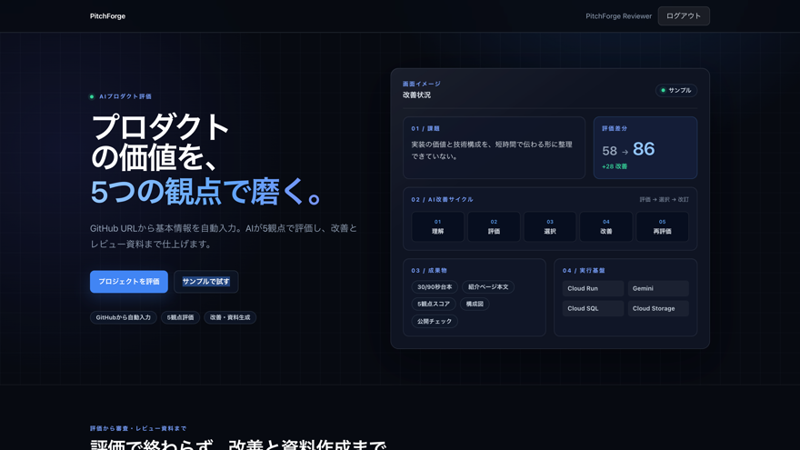

# PitchForge

PitchForge is an AI product readiness and improvement workspace for product teams.

プロダクト情報、URL、画面素材、技術構成メモを入力すると、複数のAIエージェントが価値・UX・実装を5つの観点で評価します。弱点を選んで改善し、審査・レビュー向けのデモ台本、公開用紹介文、ビジュアル案、アーキテクチャ説明、公開準備チェックまで一つのワークスペースで整えます。

The product makes Google Cloud value visible in the workflow: Cloud Run serves the app, Gemini evaluates products and generates improvement materials, Cloud SQL stores pre-provisioned accounts and user-scoped history, and Cloud Storage keeps uploaded assets.

The public `/demo` route is a statically rendered, read-only workspace. It uses committed sample data
and never calls the project, GitHub import, asset, run, Gemini, Cloud SQL, or Cloud Storage APIs. The
authenticated `/projects` routes remain the only path for creating projects and running AI workflows.

## Product media

[](docs/media/pitchforge-demo.mp4)

- [90-second product demo (MP4)](docs/media/pitchforge-demo.mp4)
- [Product overview](docs/media/pitchforge-overview.png)
- [GitHub import and AI workflow](docs/media/pitchforge-ai-flow.png)
- [Five-category evaluation](docs/media/pitchforge-score.png)
- [Generated review materials](docs/media/pitchforge-artifacts.png)
- [System architecture](docs/media/pitchforge-architecture.png)

These are curated public product assets used for the ProtoPedia listing and hackathon submission.

## GitHub-first project setup

New projects can start from a single public GitHub repository URL. PitchForge reads the README and
a small allowlist of root configuration files, extracts repository metadata and technology choices,
and asks Gemini for an editable first draft of the existing project fields. If Gemini is unavailable,
the same flow returns a mechanical draft with the fields that still need confirmation clearly marked.

Import is intentionally a two-step flow: reading a repository does not create a project or write a
draft to the database. The user reviews and edits every field first, then explicitly creates the
workspace. Only top-level public `https://github.com/{owner}/{repository}` URLs are accepted; the
server connects only to fixed GitHub API endpoints, follows no redirects, bounds source and request
sizes, masks common credential patterns, and limits repeated imports before calling GitHub or Gemini.

GitHub access currently uses the unauthenticated public REST allowance, so the application reserves
at most five imports per user per 10 minutes, eight imports globally per hour, and one import per
repository per minute in PostgreSQL. These limits protect the shared 60-request/hour GitHub quota
because one import can make up to seven bounded API reads. Before increasing traffic, add a GitHub
App or a least-privilege server token, then raise the application limits deliberately.

## Publishing adapters

The core workflow produces platform-neutral review and release materials. Event or publishing-site
requirements are applied only by explicit adapters; the current Findy adapter can format the generic
artifacts for ProtoPedia and the associated submission form without changing the normal product UI.

## Public Repository Safety

This repository is intended to be public.

- Do not commit `.env`, `.env.local`, service account JSON, user-uploaded screenshots, unreviewed generated exports, or local database/storage volumes. Curated public product media belongs under `docs/media/`.
- Keep `.env.example` as placeholders only.
- Do not paste real API keys, access tokens, service account emails, project IDs, bucket names, or private customer data into README, tests, fixtures, screenshots, or issues.
- Runtime status and readiness APIs intentionally expose only coarse mode/health labels, not credentials.
- User-provided project text and screenshots are treated as untrusted source material in AI prompts.

## Local Development

Local development is Docker Compose only. Do not run the app directly on the host Node.js runtime
for normal development.

Start the app:

```bash
docker compose up web
```

Then open `http://localhost:3000`.

Run checks inside containers:

```bash
docker compose run --rm lint
docker compose run --rm test
docker compose run --rm build
```

Seed the local demo project:

```bash
docker compose run --rm seed
```

Reset local container state if needed:

```bash
docker compose down -v
```

Docker Compose uses `Dockerfile.dev` and does not change the Cloud Run production `Dockerfile` or
`cloudbuild.yaml`.

Local Compose runs the app without live GCP infrastructure except Gemini:

- `db` is a PostgreSQL container compatible with the Cloud SQL for PostgreSQL production target.
- `gcs` is `fake-gcs-server`, a lightweight Cloud Storage-compatible emulator.
- `AUTH_MODE=local` creates a development-only account and signed session cookie. It is rejected in production.
- `AI_PROVIDER=gemini` uses Gemini. Set `GEMINI_API_KEY` in your shell or an ignored local env file before running AI workflows.
- `DATABASE_URL` points at the `db` container.
- `GCS_API_ENDPOINT` points at the `gcs` container.

The host `package.json` scripts are still used by CI and Docker images, but local development
commands should go through `docker compose`.

## Environment

Key variables:

- `NEXT_PUBLIC_AUTH_MODE=password` for the production login UI (`local` is for Docker Compose only)
- `AUTH_MODE=password` for production (`local` is rejected when `NODE_ENV=production`)
- `AUTH_SESSION_SECRET` for signing password-auth sessions; use a random value of at least 32 characters and keep it in Secret Manager
- `SESSION_COOKIE_NAME=__Host-pitchforge_session_v2` in production
- `AUTH_BYPASS_FOR_TEST=false` outside local tests and Docker Compose
- `AI_PROVIDER=auto|mock|gemini`
- `GEMINI_MODEL=gemini-2.5-flash`
- `GEMINI_API_KEY=` for API-key mode
- `GOOGLE_GENAI_USE_VERTEXAI=true` with `GOOGLE_CLOUD_PROJECT` and `GOOGLE_CLOUD_LOCATION` for Vertex mode
- `DATABASE_MODE=postgres`
- `DATABASE_URL=postgres://...`
- `STORAGE_MODE=gcs`
- `GCS_BUCKET=your-gcs-bucket-name`
- `GCS_API_ENDPOINT=http://gcs:4443` for local fake-gcs-server only

Use placeholders in documentation. Keep credentials and secret values only in ignored local
configuration or Secret Manager; keep non-secret deployment identifiers in repository variables.

## Authentication and User Data

PitchForge uses pre-provisioned login IDs and password authentication. Cloud Run remains publicly
reachable, but protected pages and APIs require a valid app session.

- There is no sign-up flow. An operator creates each allowed account in advance with `npm run auth:provision`.
- Password hashes and account state are stored in the Cloud SQL `auth_users` table. Plaintext passwords are never stored in the database.
- `/login` exchanges valid credentials for a signed, `httpOnly`, `Secure`, `SameSite=Lax` session cookie in production.
- `AUTH_SESSION_SECRET` signs sessions and login-throttle keys. It is independent of every account password and must be rotated as a production secret.
- Failed login counters and temporary lockouts are shared through the Cloud SQL `auth_login_attempts` table.
- In local Compose, `/login` uses `AUTH_MODE=local` and creates a development-only session without provisioning an account.
- `/api/projects`, assets, runs, events, artifacts, and exports are scoped to the authenticated
  project owner.
- Disabling an `auth_users` record invalidates that user's session on the next authenticated request.
- Billing and plans are intentionally not implemented yet. Expensive import and AI entry points use
  narrow abuse guards; a product-wide metering and quota model remains a separate SaaS concern.

Provisioning reads the password only from standard input and refuses an interactive TTY. Run it
from an operator environment that can reach the database, with `DATABASE_URL` configured. For
example, pipe a dedicated review-account password secret without printing it:

```bash
gcloud secrets versions access latest --secret=review-login-password | \
  npm run auth:provision -- review-user review-login reviewer@example.com "PitchForge Reviewer"
```

The positional arguments are `uid`, `loginId`, `email`, and `displayName`. Use a unique password of
at least 20 characters. Do not give the Cloud Run runtime service account access to the plaintext
review-account password secret; the runtime needs only the stored hash in Cloud SQL.

## Container Commands

```bash
docker compose up web
docker compose run --rm db-migrate
docker compose run --rm lint
docker compose run --rm test
docker compose run --rm build
docker compose run --rm seed
```

## Cloud Run Deployment Outline

Prepare Google Cloud resources outside this repository:

1. Enable required APIs for Cloud Run, Vertex AI, Cloud SQL, Cloud Storage, Cloud Build, Artifact Registry, and Secret Manager.
2. Create a Cloud SQL for PostgreSQL instance/database and a Cloud Storage bucket.
3. Store the production `DATABASE_URL` and an independent random `AUTH_SESSION_SECRET` in Secret Manager.
4. Configure the Cloud Run service account with only the permissions required for Cloud SQL connection, Storage, Vertex AI, and access to those two runtime secrets.
5. Apply the schema, pre-provision a review account, and keep its plaintext password in a separate operator-only secret.
6. Deploy with placeholder values replaced in your shell or deployment system, not in committed files.

Example shape:

```bash
gcloud run deploy pitchforge \
  --source . \
  --region asia-northeast1 \
  --timeout=900s \
  --max-instances=3 \
  --concurrency=4 \
  --allow-unauthenticated \
  --set-cloudsql-instances=your-cloud-sql-connection-name \
  --set-secrets DATABASE_URL=your-database-url-secret:latest,AUTH_SESSION_SECRET=your-auth-session-secret:latest \
  --set-env-vars NEXT_PUBLIC_DEMO_MODE=true,NEXT_PUBLIC_AUTH_MODE=password,AUTH_MODE=password,SESSION_COOKIE_NAME=__Host-pitchforge_session_v2,AI_PROVIDER=gemini,GEMINI_MODEL=gemini-2.5-flash,GOOGLE_GENAI_USE_VERTEXAI=true,GOOGLE_CLOUD_PROJECT=your-gcp-project-id,GOOGLE_CLOUD_LOCATION=global,DATABASE_MODE=postgres,STORAGE_MODE=gcs,GCS_BUCKET=your-gcs-bucket-name
```

Do not commit the concrete project ID, bucket name, or credentials used for deployment.

## Automatic Deploy from GitHub main after CI

This repository uses GitHub Actions for the gate and Cloud Build for the deploy. The deploy job runs
only after `npm run lint`, `npm test`, and `npm run build` pass on `main`.
Superseded pull-request runs are cancelled, while `main` push workflows are queued and deployed
serially so an older external Cloud Build cannot finish after and overwrite a newer revision.

The workflow keeps CI fast by using npm cache, one dependency install for the CI job, and a separate
Cloud Build image build only on successful `main` pushes.

The deploy job submits the public GitHub repository URL plus the pushed commit SHA to Cloud Build,
rather than uploading the GitHub runner's local working tree to a Cloud Storage staging bucket. If
the repository becomes private, replace this with a Cloud Build repository connection or another
private-source mechanism.

The run `POST` awaits the AI improvement workflow within its request while the UI polls run progress in
separate requests every two seconds. Cloud Build configures the Cloud Run request deadline to 15
minutes (`--timeout=900s`) for this execution model. This is not a durable queue and does not
guarantee that work will continue or can be resumed after a browser or network disconnection. If
longer jobs or retry durability become necessary, design an authenticated queue worker (for example,
Cloud Tasks) with idempotency as a separate production change.
Before listing or starting a run, PostgreSQL marks active runs without an update for 20 minutes as
failed so an interrupted request cannot block the project indefinitely.

Those npm scripts are CI commands. Local development remains Docker Compose only.

The deploy configuration below contains identifiers rather than credentials: project, bucket,
service-account, Workload Identity Provider, Cloud SQL connection, and Secret Manager secret names.
Keep these identifiers in GitHub repository variables so the workflow matches the deployed
environment without committing concrete values to the repository.

Required GitHub repository variables:

- `GCP_PROJECT_ID`
- `GCP_WORKLOAD_IDENTITY_PROVIDER`
- `GCP_DEPLOY_SERVICE_ACCOUNT`
- `GCS_BUCKET`
- `DATABASE_URL_SECRET`
- `AUTH_SESSION_SECRET`
- `CLOUD_SQL_INSTANCE_CONNECTION_NAME`
- `CLOUD_RUN_RUNTIME_SERVICE_ACCOUNT`

Optional GitHub repository variables:

- `GCP_REGION`, default `asia-northeast1`
- `CLOUD_RUN_SERVICE`, default `pitchforge`
- `AR_REPOSITORY`, default `pitchforge`
- `GOOGLE_CLOUD_LOCATION`, default `global`

`DATABASE_URL_SECRET` and `AUTH_SESSION_SECRET` are Secret Manager **secret names**, not their
secret values. Keep the actual database URL and signing key only in Secret Manager; never copy
either secret value into GitHub Actions secrets, repository variables, workflow arguments, or logs.

When migrating an existing repository, first configure all 8 required repository variables, then
merge the workflow change into `main`. If the workflow change reaches `main` before the variables are
configured, the deploy job intentionally fails validation and does not start Cloud Build.

`cloudbuild.yaml` is called by the deploy job after CI succeeds.

Expected trigger substitutions:

- `_REGION`: Cloud Run and Artifact Registry region, for example `asia-northeast1`
- `_SERVICE`: Cloud Run service name, for example `pitchforge`
- `_AR_REPOSITORY`: Artifact Registry Docker repository name
- `_IMAGE_TAG`: Image tag, normally the GitHub commit SHA
- `_GCS_BUCKET`: Cloud Storage bucket used by the running app
- `_DATABASE_URL_SECRET`: Secret Manager secret name containing the PostgreSQL `DATABASE_URL`
- `_AUTH_SESSION_SECRET`: Secret Manager secret name containing the session signing key
- `_CLOUD_SQL_INSTANCE_CONNECTION_NAME`: Cloud SQL instance connection name
- `_GOOGLE_CLOUD_LOCATION`: Vertex AI location, for example `global`
- `_GEMINI_MODEL`: Vertex AI model ID, default `gemini-2.5-flash`
- `_CLOUD_RUN_RUNTIME_SERVICE_ACCOUNT`: runtime service account used by Cloud Run.

The GitHub Actions deploy service account needs permission to submit Cloud Build jobs, use the
quota project, and act as the Cloud Build execution service account.

Cloud Build's service account needs permissions to:

- build and push images to Artifact Registry
- deploy and update the Cloud Run service
- attach the configured Cloud SQL instance
- act as the Cloud Run runtime service account

The Cloud Run runtime service account needs only the app runtime permissions:

- Vertex AI user
- Cloud SQL client
- Cloud Storage object access for the configured bucket, including `storage.objects.list`
  (`roles/storage.objectUser` satisfies the readiness list operation)
- Secret Manager secret accessor for the `DATABASE_URL` and `AUTH_SESSION_SECRET` runtime secrets

The runtime service account must not have access to the separate plaintext review-account password secret.

## Deployment Verification and Password Auth Cutover

The public `GET /api/system/status` endpoint verifies only coarse runtime configuration. The public
`GET /api/system/readiness` endpoint additionally runs PostgreSQL schema initialization plus
`SELECT 1` and lists at most one object from the configured Cloud Storage bucket. It returns only
fixed `ok`/`failed` labels, never connection strings, bucket names, object names, or raw errors.
Production readiness never creates the configured bucket; create it and grant access before deploy.

The public readiness endpoint deliberately does not call Gemini. Calling a billable model from an
unauthenticated health endpoint would enable cost abuse. After status and readiness pass, perform a
manual AI canary while signed in with a pre-provisioned review account: create one real project,
start one run, and confirm that login creates a session, a reload remains signed in, and progress,
final score, artifacts, architecture export, and Markdown/JSON export complete successfully.

Use this cutover checklist:

1. Create independent Secret Manager secrets for `DATABASE_URL`, `AUTH_SESSION_SECRET`, and the operator-only review-account password. Grant the runtime account access only to the first two.
2. Verify the Cloud SQL database and Cloud Storage bucket, then run the schema migration.
3. Pre-provision the review account with `npm run auth:provision`; do not add a public sign-up path.
4. Deploy and require `/api/system/status` to report `authMode: "password"` and both public status and readiness smoke checks to pass.
5. Run the authenticated Gemini canary described above and verify the deployed URL, login, polling, final artifacts, and exports are stable.
6. Share review-account credentials only through the designated secure channel after the canary passes.
